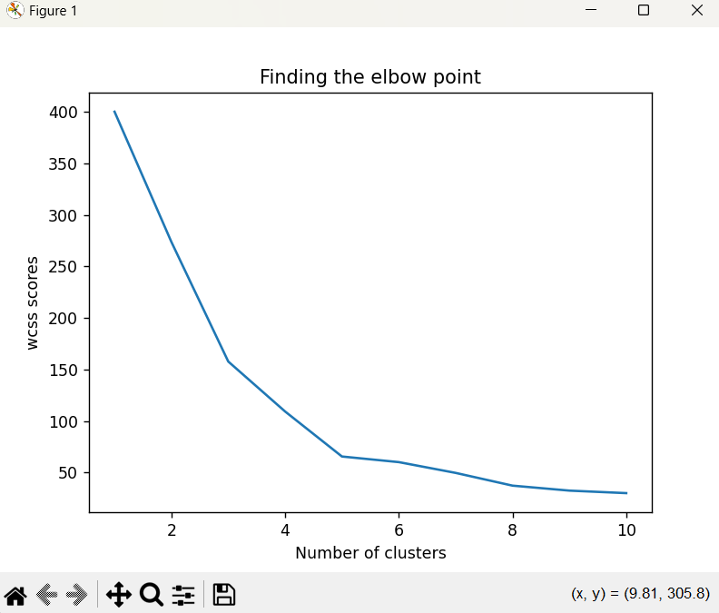
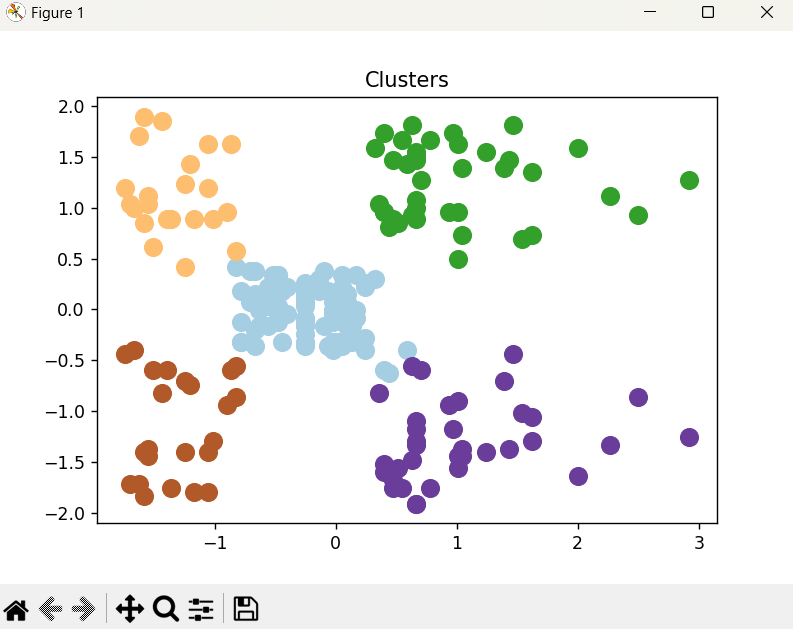
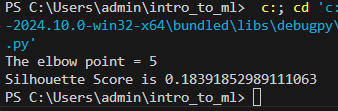

# Implementation-of-K-Means-Clustering-for-Customer-Segmentation

## AIM:
To write a program to implement the K Means Clustering for Customer Segmentation.

## Equipments Required:
1. Hardware – PCs
2. Anaconda – Python 3.7 Installation / Jupyter notebook

## Algorithm
1. Import All the necessary packages.
2. Use The kmeans model to find wcss score and plot the elbow graph to find number of clusters.
3. Using the KMeans model and the number of clusters, plot the clusters using matplotlib.
4. Find the Silhouette score.

## Program:
```
/*
Program to implement the K Means Clustering for Customer Segmentation.
Developed by: Shri Sai Aravind R
RegisterNumber:  212223040197
*/
```
```py
import numpy as np
import pandas as pd
from sklearn.preprocessing import StandardScaler
from sklearn.cluster import KMeans
from sklearn.metrics import silhouette_score
import matplotlib.pyplot as plt
from kneed import KneeLocator
import warnings
warnings.filterwarnings("ignore")

def encoder(dataset, column):
    dataset = pd.get_dummies(data=dataset, columns= column, drop_first=True)
    return dataset

def main_kmeans(dataset):
    res = kmeans(dataset)
    y_predict, km, wcss = res[0], res[1], res[2]
    k = elbow_point(wcss)
    print(f"The elbow point = {k}")

    labels = km.labels_
    score = silhouette_score(dataset, labels, metric="cosine")
    print("Silhouette Score is",score)
    plot_kmeans(k,dataset, y_predict)

def elbow_point(wcss):
    k_vals = [i for i in range(1,11)]
    knee_locator = KneeLocator(k_vals, wcss, curve='convex', direction='decreasing')
    elbow_point = knee_locator.elbow
    return elbow_point


def kmeans(dataset):
    wcss_list = []
    for i in range(1,11):
        km = KMeans(n_clusters=i, init="k-means++", random_state=42)
        km.fit(dataset)
        wcss_list.append(km.inertia_)
    kmeans = KMeans(n_clusters=elbow_point(wcss_list), init="k-means++", random_state=42)
    y_predict = kmeans.fit_predict(dataset)
    plt.plot(range(1,11), wcss_list)
    plt.title("Finding the elbow point")
    plt.xlabel("Number of clusters")
    plt.ylabel("wcss scores")
    plt.show()
    #print(y_predict)
    return [y_predict, kmeans, wcss_list]

def plot_kmeans(k,x, y_predict):
    for i in range(k):
        colormap = plt.cm.Paired
        colors = colormap(np.linspace(0, 1, k))
        plt.scatter(x.iloc[y_predict == i,0], x.iloc[y_predict == i,1], s = 100, c = colors[i], label = f'Cluster {i+1}')
    plt.title("Clusters")
    plt.show()

dataset = pd.read_csv("Mall_Customers.csv")
print(dataset.head())

dataset = dataset.drop(["CustomerID", "Gender", "Age"], axis = 1)
scaler = StandardScaler()
dataset[["Annual Income (k$)", "Spending Score (1-100)"]] = scaler.fit_transform(dataset[["Annual Income (k$)", "Spending Score (1-100)"]])

print(dataset)
main_kmeans(dataset)
```

## Output:
### Elbow Graph Plot



### Cluster Visualization



### Number Of Clusters (Elbow Point Value) and Silhouette Score



## Result:
Thus the program to implement the K Means Clustering for Customer Segmentation is written and verified using python programming.
